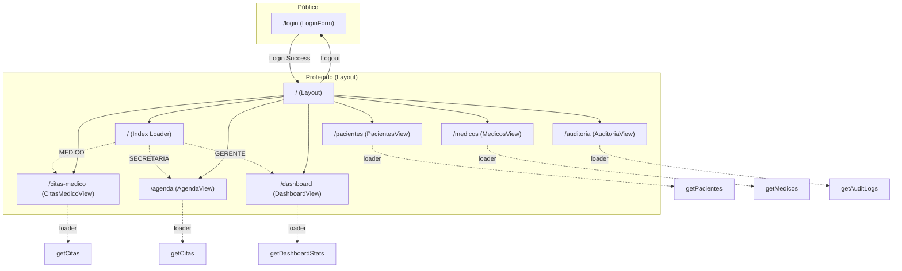
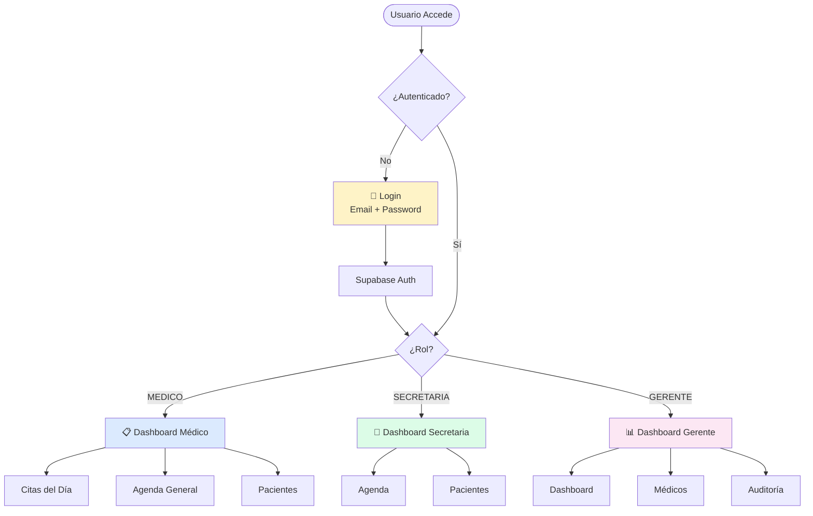

# Diagrama de Rutas (React Router v7)

Este diagrama representa la estructura de navegación implementada con React Router.



## Detalles de Implementación

- **Router**: `createBrowserRouter` en `src/router.tsx`.
- **Protección**: `protectedLoader` verifica el token antes de renderizar el Layout.
- **Redirección Inicial**: `rootIndexLoader` redirige a la vista principal según el rol del usuario.
- **Data Fetching**: Se utiliza `loader` en las rutas (ej. `dashboardLoader`) para cargar datos en paralelo a la navegación.
- **Navegación**: `<NavLink>` en el Sidebar para navegación SPA real.

    
    subgraph "Rutas / Vistas Protegidas"
        direction TB
        
        %% Vistas Compartidas
        Pacientes[PacientesView]
        Medicos[MedicosView]
        Agenda[AgendaView]
        
        %% Vistas Específicas
        CitasMedico[CitasMedicoView]
        Dashboard[DashboardView]
        Auditoria[AuditoriaView]
    end

    %% Flujo MEDICO
    RoleCheck -- MEDICO --> CitasMedico
    subgraph "Menú Médico"
        M_Link1[Citas del Día] -.-> CitasMedico
        M_Link2[Agenda General] -.-> Agenda
        M_Link3[Pacientes] -.-> Pacientes
    end

    %% Flujo SECRETARIA
    RoleCheck -- SECRETARIA --> Agenda
    subgraph "Menú Secretaria"
        S_Link1[Agenda] -.-> Agenda
        S_Link2[Pacientes] -.-> Pacientes
        S_Link3[Médicos] -.-> Medicos
    end

    %% Flujo GERENTE
    RoleCheck -- GERENTE --> Dashboard
    subgraph "Menú Gerente"
        G_Link1[Dashboard] -.-> Dashboard
        G_Link2[Médicos] -.-> Medicos
        G_Link3[Auditoría] -.-> Auditoria
    end
```

## 🎯 Navegación por Rol (Frontend)

