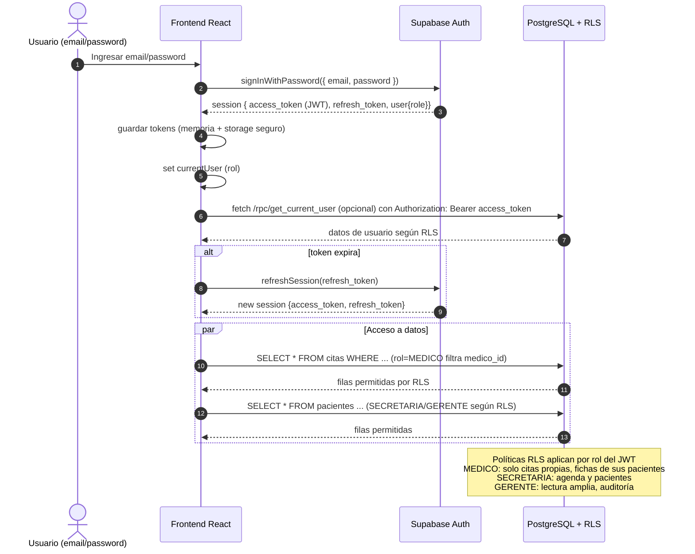

# Diagrama de secuencia: Login + RBAC (Supabase)

Suposiciones: uso de `@supabase/supabase-js` en frontend; políticas RLS activas en tablas (pacientes, citas, fichas, audit_logs, medicos). Claims de rol vienen en el JWT (`app_metadata.role`).

## Pasos clave
1) `supabase.auth.signInWithPassword({ email, password })` → recibir `session` con `access_token`, `refresh_token`, `user`.
2) Guardar tokens: memoria + `localStorage`/`sessionStorage` (o `Secure Storage` móvil). Enviar `Authorization: Bearer <access_token>` a API/SQL.
3) Lectura del rol: `session.user.app_metadata.role` → usar en UI (menús) y en llamadas (p.ej. filtrar por médico actual).
4) Refresh: `supabase.auth.refreshSession()` al expirar el access token.
5) RLS: crear políticas en tablas usando `auth.jwt()->>'role'` para restringir filas.
