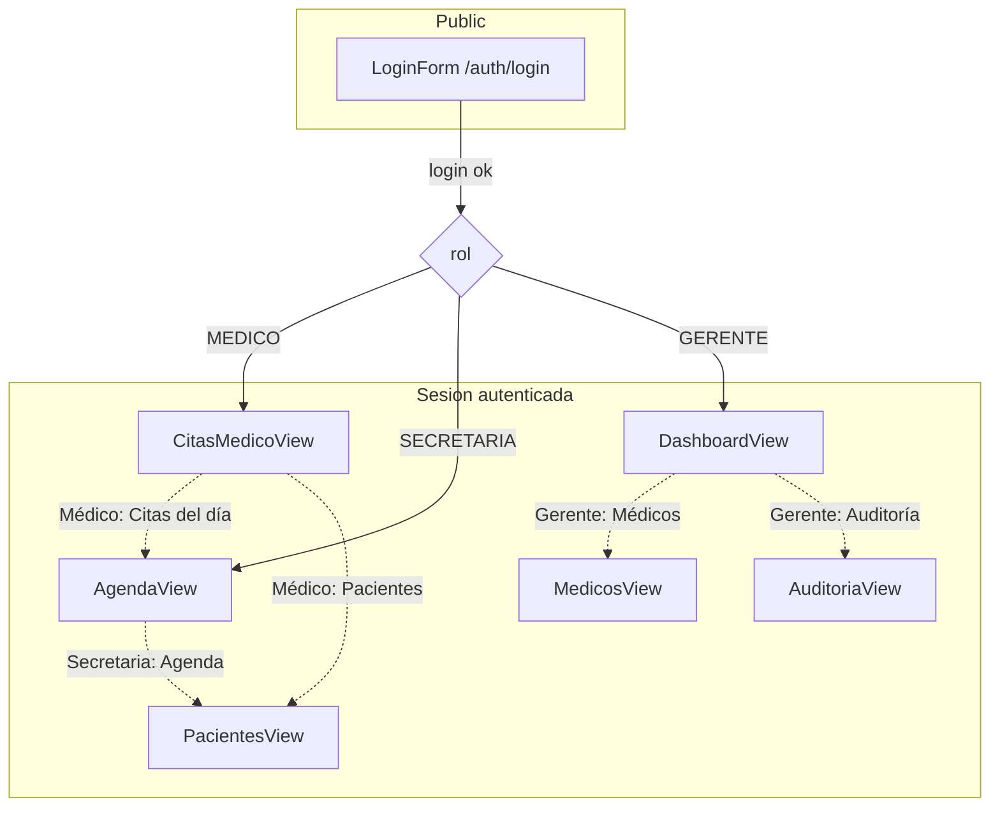

# Sitemap y RBAC

## Mapa de vistas (Mermaid)

## Restricciones por rol
- MEDICO: ver_fichas, crear_fichas, ver_citas_propias, ver_pacientes.
- SECRETARIA: ver_pacientes, crear_pacientes, actualizar_pacientes, ver_agenda, gestionar_citas.
- GERENTE: ver_logs, gestionar_usuarios, ver_reportes, configurar_sistema.

## Flujos principales por rol
- Médico: login → vista `citas-medico` → lee citas del día (`GET /citas?fecha&medico_id`) → agenda general → abre fichas de paciente (`GET /fichas/paciente/{id}`) → crea ficha (`POST /fichas`).
- Secretaria: login → vista `agenda` → gestiona citas (`GET/POST/PUT/DELETE /citas`) con filtros por fecha/paciente/médico → administra pacientes (`GET /pacientes`, `POST/PUT /pacientes/{id}`) con validación RUT/teléfono/edad.
- Gerente: login → vista `dashboard` → métricas (`GET /dashboard/{rol}`) → gestiona médicos (`GET/POST/PUT/DELETE /medicos`) → revisa auditoría (`GET /audit`).

## Funciones y servicios clave (para mapear a BaaS)
- Autenticación: `apiClient.login`, `apiClient.getCurrentUser`, `AuthProvider` (token en `localStorage`, header Authorization).
- Pacientes: `getPacientes`, `getPaciente`, `createPaciente`, `updatePaciente`, `deletePaciente`.
- Citas: `getCitas`, `createCita`, `updateCita`, `deleteCita`.
- Fichas clínicas: `getFichasByPaciente`, `createFicha`.
- Auditoría: `getAuditLogs`.
- Dashboard: `getDashboardStats`.
- Médicos: `getMedicos`, `createMedico`, `updateMedico`, `deleteMedico`.
- UI/RBAC: `Layout` arma menú por `user.rol`; `hasPermission` centraliza permisos.
